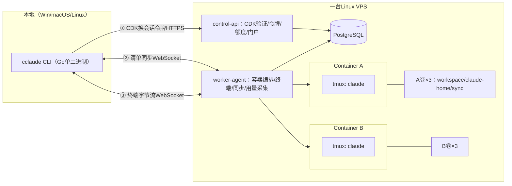

# 双项目远程Claude工作空间设计（Design Spec）

**日期：** 2026-07-19
**状态：**待用户审阅
**来源：** `code1/cclaude/cclaude-replication-blueprint.md`（可行性蓝图）与`code1/cclaude/2026-07-19-cclaude-like-remote-workspace.md`（初版实施计划），经澄清问答与环境验证后定稿。

---

## 1. 目标与范围

构建一套供**同一管理员**使用的远程Claude Code工作空间：

- 一台Linux VPS上运行两个完全隔离的项目容器（Project A/Project B）；
- 每个项目**单独一张CDK**（CDK-A只能连Project A，一对一绑定）；
- 本地目录与云端workspace**双向文件同步**（自研清单同步，全文件粒度）;
- Claude Code在云端tmux会话中持续运行，本地断线不中断，重连即恢复；
- 项目级**磁盘配额**与项目级**5小时/7天内部额度闸门**；
- 简单的SSR用量门户页。

**范围决策记录（来自澄清问答）：**

| 决策点 | 结论 |
|---|---|
| 开发范围 | 双项目个人版（文档2的范围），不做多租户平台 |
| CDK模型 | 每项目一张CDK，平台凭据，与Claude凭据无关 |
| 代码位置 | `/root/code1/remote-claude-workspace/`，独立git仓库 |
| 本地CLI平台 | Windows、macOS、Linux三平台都支持 |
| 同步路线 | 自研SHA-256清单同步，全文件粒度，不做分块增量 |

**合规立场：**本系统仅供同一账号所有者本人的两个项目使用。管理员在两个容器内分别用官方流程完成Claude Code登录；系统不复制、不下发、不展示OAuth凭据，不向第三方转售访问权。这是与"把订阅拆成CDK出售"划清界限的根本约束，写入验收标准。

**非目标：**多租户/多用户、LLM Gateway代理计费、分块增量同步、Kubernetes编排、浏览器终端、对外商业运营。

## 2. 可行性深度分析

### 2.1已实证的事实（本机验证，2026-07-19）

1. **用量采集可行——这是原计划中最大的未知项，现已消除。**实测本机Claude Code会话JSONL（`~/.claude/projects/<dir>/<session>.jsonl`），每条`type=assistant`记录含：
   - `requestId`（如`req_011Ccq...`）——全局唯一，作为`source_event_id`天然支持幂等去重；
   - `timestamp`（ISO 8601格式，UTC时区）、`message.model`；
   - `message.usage`：`input_tokens`、`output_tokens`、`cache_read_input_tokens`、`cache_creation_input_tokens`。
   因此用量采集器的确定方案是：worker-agent定时扫描各项目Claude HOME卷内的JSONL增量行，解析入库。不需要OTEL配置，不需要网络抓取。
2. **tmux 3.4本机可用**，detach/reattach行为符合断线恢复需求；终端模块的集成测试可以在开发机直接跑真实tmux。
3. **开发环境缺口：本地无Go、无Docker。**对策：任务清单第一项安装Go工具链（≥1.22）；Docker编排逻辑以接口抽象+假Docker API做单元测试（初版计划已如此设计），真实容器验收在目标VPS上执行。

### 2.2风险清单与对策

| # | 风险 | 等级 | 对策 |
|---|---|---|---|
| R1 | 官方5h/7d限额是**账号级**，无逐项目API，内部额度只是估算 | 高 | 门户明确标注"内部额度单位"；闸门公式含整体安全余量；预留`AccountUsageProvider`接口供未来校准 |
| R2 | 两容器共用同一账号，OAuth凭据独立性未证实（refresh token是否互踢） | 中 | 每次登录是独立grant，理论上互不影响；在容器任务中加入双容器同时登录并各自运行24h的验证步骤，失败则降级为"分时使用"运行手册 |
| R3 | JSONL是非公开格式，Claude Code升级可能变动字段 | 中 | 采集器容错解析（未知字段忽略、坏行跳过并计数）；用真实样例锁定解析测试；升级镜像前先跑兼容测试 |
| R4 | Windows路径/换行差异破坏同步一致性 | 中 | 清单统一存储forward-slash相对路径；同步按字节精确传输，不做换行转换；路径规则在Windows/Linux/macOS三平台跑单元测试 |
| R5 | Claude在云端写文件与同步读取竞态（读到半写文件） | 中 | watcher侧500ms静默窗口；传输前后各算一次SHA-256，不一致则重读；服务端`.tmp`+原子重命名 |
| R6 | Windows终端渲染 | 低 | PTY在云端，CLI只做字节转发；本地raw mode用`golang.org/x/term`（三平台支持）；resize走独立控制消息 |
| R7 | 单VPS单点故障 | 低（个人系统可接受） | 每日`pg_dump`+卷tar快照到独立目录；runbook写明恢复步骤 |

### 2.3可行性结论

**可行。**所有核心机制（CDK哈希认证、容器+卷隔离、tmux会话保持、WebSocket转发、清单同步、逻辑字节配额、JSONL用量采集）都基于已验证的公开能力，无需依赖cclaude的私有实现（如ATimes fork）。唯一原理性限制是R1：内部额度无法与官方订阅百分比精确对齐，本设计以"估算+安全余量+明确标注"处理，不伪装精确。

## 3. 总体架构



四个可执行组件（Go单仓，`cmd/`三个二进制+一个容器镜像）：

| 组件 | 职责 | 边界 |
|---|---|---|
| `cclaude`（本地CLI） | 输入CDK→同步→附着终端→状态栏 | 只操作当前项目目录；CDK不进日志/命令行参数 |
| `control-api` | CDK验证、签发短期令牌、额度/磁盘查询、SSR用量页 | 唯一对外HTTPS入口；不接触文件内容 |
| `worker-agent` | 建容器/卷、tmux、WebSocket终端与同步端点、JSONL用量采集 | 唯一持有Docker权限的进程；只接受control-api签发的令牌 |
| 项目容器×2 | 运行官方Claude Code | 非root、无Docker socket、只挂本项目三卷；可随时重建 |

目录结构沿用初版计划第三节（`cmd/`、`internal/auth|config|control|project|quota|runtime|storage|store|sync|terminal|usage`、`migrations/`、`web/templates/`、`deploy/`、`tests/e2e/`）。

## 4. 数据模型

沿用初版计划第四节的六张表：`accounts`、`projects`、`cdks`、`usage_events`、`file_index`、`sessions`，另加两点澄清：

1. `usage_events.source_event_id`存JSONL的`requestId`，`UNIQUE`约束实现幂等；
2. 终端/同步连接令牌**不落库**：由control-api用HMAC签名的短期令牌（15分钟、单用途、含project_id与audience字段），worker-agent本地验签，避免为临时令牌建表。

`ConnectionResponse`合同沿用初版计划（project、terminal_url、sync_url、磁盘与5h/7d用量、`over`/`over_reason`）。

## 5. 认证与令牌

```text
CDK（明文只显示一次，库中只存Argon2id哈希）
  ①`/v1/auth/exchange`（POST）换取会话令牌（15分钟）
  ②`/v1/connection`（GET）换取终端令牌+同步令牌（各15分钟，单用途，audience区分）
```

- CDK支持`expires_at`/`disabled_at`；验证失败统一返回同一错误（不泄露CDK是否存在）；
- CLI从交互输入或系统凭据存储读CDK，禁止命令行参数传入；
- 管理操作（建项目、发CDK、登录引导）走仅监听localhost的管理socket，与CDK API物理分离。

## 6. 容器与卷生命周期

- 每项目三个命名卷：`<slug>-workspace`→`/workspace`、`<slug>-claude`→`/home/claude/.claude`、`<slug>-sync`→`/var/lib/cclaude-sync`；容器删除/重建不删卷，只有管理端显式"删除项目并删卷"才清理数据。
- 启动命令：`tmux -L <project-id> new-session -A -s main -c /workspace claude`（`-c`与路径之间的空格为命令语法，不适用中文排版规则）。
- 安全基线：非root用户、无Docker socket、无额外capabilities、CPU/内存/PID/tmpfs限制、独立网络。
- **Claude登录runbook：**管理员通过管理socket分别进入Container A/B执行一次官方登录；凭据只存在各自claude-home卷；随后执行R2验证（双容器同时运行24小时，确认凭据互不失效）。

## 7. 终端通道

- WebSocket升级时验终端令牌；连接后worker-agent在容器内attach tmux并转发PTY字节流；
- 控制消息：resize（rows/cols）、ping/pong；
- 断开只关闭PTY/WebSocket，**绝不**`tmux kill-session`；重连以相同project-id附着同一会话；
- CLI侧：raw mode（`golang.org/x/term`），窗口变化发resize，断线指数退避自动重连。

## 8. 文件同步协议（自研，全文件粒度）

清单条目：`{path, size, sha256, revision, deleted}`；客户端与服务端各维护索引（服务端在`file_index`表，客户端在项目内`.cclaude/index.db`）。

消息流：`Hello(project, cursor)→ManifestDiff→PutFile/GetFile（整文件+SHA校验）→Tombstone→Ack(cursor)`。

规则（沿用初版计划第六节，全部保留）：

- 只接受UTF-8相对路径，拒绝绝对路径、`..`、指向项目外的符号链接；
- 默认排除：`.env`、`.cclaude/`、SSH/AWS/云厂商凭据目录、Claude登录文件；
- 上传先写`.cclaude.tmp.<revision>`，SHA-256校验通过后原子重命名；
- 双端同时修改：不覆盖，生成`<name>.conflict-<device>-<time>`并在CLI提示；
- 删除以tombstone传播；断线重连后按cursor补传；
- watcher（fsnotify）500ms静默窗口后才计算哈希入队。

## 9. 磁盘配额

- `disk_used = SUM(size_bytes WHERE deleted=false)`，与文件索引同事务更新，精确到字节；
- 超限时拒绝新增/扩大写入，允许删除与缩小；
- 门户与CLI状态栏展示同一数值（GB/GiB单位标注清晰）。

## 10. 用量采集与额度闸门

- worker-agent每30秒增量扫描各项目claude-home卷的JSONL（记录文件偏移量，只读新行）；
- 每条assistant记录换算加权单位：`in×w1 + out×w2 + cache_read×w3 + cache_write×w4`（权重可配置，参考官方计费比例）；按`requestId`幂等入库；
- 项目闸门：`over = 5h用量≥上限 || 7d用量≥上限 || 磁盘≥上限`；
- 整体闸门：`允许A⇔A未超自身上限 且 池估算剩余 > B预留+安全余量`；
- 超限动作：control-api拒发新连接令牌并返回`over_reason`；已建立的终端连接保留（允许收尾），同步仅允许下载与删除；
- `AccountUsageProvider`接口预留，未来有获授权的上游用量来源时校准，不写抓取逻辑进核心。

## 11. 用量门户

SSR单页（`web/templates/usage.html`，30秒自动刷新）：两个项目各自的5h/7d用量与上限、磁盘用量与上限、重置时间、容器/会话状态；明确区分"内部项目额度（估算）"与"上游整体用量"。授权：Project A的会话令牌查不到Project B明细。

## 12. 错误处理与竞态

| 场景 | 行为 |
|---|---|
| CLI断网 | 终端与同步独立退避重连；tmux与Claude不受影响 |
| worker-agent崩溃 | systemd自动重启；容器与tmux不依赖agent存活；重启后重建文件偏移量游标（从库中最后`requestId`向后扫） |
| VPS重启 | systemd拉起服务，容器`restart=always`，tmux会话丢失但Claude Code的`--continue`可恢复上下文；runbook记录 |
| 同步半写文件 | 静默窗口+双SHA校验+服务端原子重命名 |
| JSONL坏行/未知字段 | 跳过并计数，指标暴露，不中断采集 |
| 采集重复 | `source_event_id`唯一约束，冲突即忽略 |
| 时钟问题 | 窗口计算一律用数据库`now()`与UTC |

## 13. 测试策略

- **单元测试（开发机可跑）：**配置、CDK哈希/绑定、路径安全、清单diff、冲突命名、配额算术、加权换算、窗口查询、JSONL解析（用真实样例文件）；
- **假Docker API测试：**挂载隔离（A容器绝不出现B卷）、卷命名稳定性、安全参数；
- **真实tmux集成测试（开发机可跑）：**断开重连后可见断开前标记；
- **e2e（目标VPS）：**初版计划Task 10全部场景——双项目隔离、双向同步、冲突副本、断线重连、A超额B可用、容器重建数据保留、整机重启恢复；
- 全程`go test ./...`与`go test -race ./...`。

## 14. 验收标准

沿用初版计划第九节十条，全部保留，另加两条：

11. macOS本地CLI通过与Windows/Linux相同的单元与手工验收；
12. 用量采集在真实JSONL样例上无重复、无遗漏（对照人工统计）。

## 15. 部署建议

8 vCPU/16GB/150–200GB SSD（最低4 vCPU/8GB/100GB）；Ubuntu 22.04/24.04+Docker Engine；`control-api`与`worker-agent`为systemd服务；PostgreSQL可容器化；每日`pg_dump`+卷快照备份。
