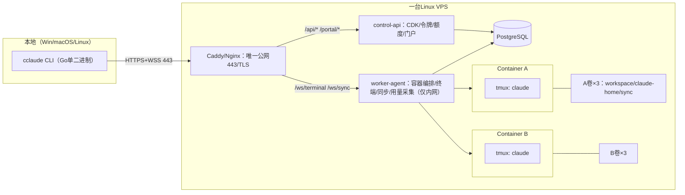

# 双项目远程Claude工作空间设计（Design Spec v2）

**日期：** 2026-07-19（v2修订同日）
**状态：**待用户审阅
**来源：** `code1/cclaude/cclaude-replication-blueprint.md`（可行性蓝图）、`code1/cclaude/2026-07-19-cclaude-like-remote-workspace.md`（初版实施计划）、澄清问答与环境验证。
**v2修订依据：** [审计与修订说明](./2026-07-19-remote-claude-workspace-audit-corrections.md)已全部吸收进本稿；若本稿仍与审计文档冲突，以审计文档为准。

---

## 1. 目标与范围

构建一套供**同一管理员**使用的远程Claude Code工作空间：

- 一台Linux VPS上运行两个完全隔离的项目容器（Project A/Project B）；
- 每个项目**单独一张CDK**（CDK-A只能连Project A，一对一绑定）；
- 本地目录与云端workspace**双向文件同步**（自研清单同步，全文件粒度，服务端revision）;
- Claude Code在云端tmux会话中持续运行，本地断线不中断，重连即恢复；
- 项目级**磁盘配额**（逻辑用量+文件系统硬配额两层）与项目级**5小时/7天内部额度闸门**（含主动执行）；
- 管理员门户页（独立登录，非CDK通道）。

**范围决策记录：**

| 决策点 | 结论 |
|---|---|
| 开发范围 | 双项目个人版，不做多租户平台 |
| CDK模型 | 每项目一张CDK，平台凭据，与Claude凭据无关 |
| 代码位置 | 本Linux仓库`/root/code1/remote-claude-workspace/`为唯一实现与审计对象；用户本地`D:\remote-claude-workspace`（FUSE同步镜像，仓库内嵌套挂载点已gitignore）只存文档副本，不代表实现结果 |
| 本地CLI平台 | Windows、macOS、Linux三平台都支持 |
| 同步路线 | 自研SHA-256清单同步，全文件粒度，服务端分配revision（见第8节） |

**合规立场：**本系统仅供同一账号所有者本人的两个项目使用。管理员在两个容器内分别用官方流程完成Claude Code登录；系统不复制、不下发、不展示OAuth凭据，不向第三方转售访问权。

**非目标：**多租户/多用户、LLM Gateway代理计费、分块增量同步、Kubernetes编排、浏览器终端、对外商业运营。

## 2. 可行性分析与待验证项

### 2.1 已实证（本机验证，2026-07-19）

1. Claude Code会话JSONL含`requestId`、`timestamp`、`message.model`与四类token的`usage`字段，采集方案为解析Claude HOME内JSONL，无需OTEL或网络抓取。
2. tmux 3.4本机可用，detach/reattach符合断线恢复需求。
3. 开发机无Go、无Docker：先装Go；Docker逻辑用假API做单元测试，真实容器验收在目标VPS。

### 2.2 架构阻断验证（Phase 1，任一失败先改设计再开发）

以下事项有初步记录但缺乏可复核证据，编码前必须重新生成**脱敏**样例并纳入自动化测试：

1. JSONL字段结构与**同一`requestId`多条记录的最终计量语义**（保留最终/最大计数，防止中间记录导致少计）；
2. **双Claude HOME同账号登录24小时互不失效**（每容器定时发起正常请求）——失败则降级为分时使用或改用官方API接入；
3. tmux在目标容器镜像中的真实TTY行为与断开/重连原型；
4. Claude Code升级后JSONL兼容性（镜像固定版本，升级前用脱敏样例跑兼容测试）。

### 2.3 风险清单与对策

| # | 风险 | 等级 | 对策 |
|---|---|---|---|
| R1 | 官方5h/7d限额是**账号级**，内部额度只是估算 | 高 | 门户标注"内部额度单位"并注明采样时间与估算属性；池保护同时算5h与7d安全余量；预留`AccountUsageProvider`校准接口；需要精确预算时改用官方API或两个独立账号 |
| R2 | 双容器同账号OAuth凭据互踢 | 高（架构前置） | Phase 1的24小时阻断验证；失败即降级分时使用 |
| R3 | JSONL非公开格式，升级可能变动 | 中 | 容错解析+脱敏样例锁定测试+镜像版本固定 |
| R4 | Windows路径/换行差异 | 中 | 清单统一forward-slash相对路径；字节精确传输；三平台路径单元测试 |
| R5 | 云端Claude写文件与同步竞态 | 中 | Worker侧watcher＋500ms静默窗口＋前后双哈希一致才入账；服务端`.tmp`+原子替换 |
| R6 | Windows终端渲染 | 低 | PTY在云端，CLI只转发字节；raw mode用`golang.org/x/term` |
| R7 | 单VPS单点故障 | 低 | 加密备份复制到VPS之外；备份前暂停写入或用一致性快照；恢复演练进验收 |
| R8 | worker-agent持Docker控制权≈宿主机高权限 | 高 | 如实定性；优先rootless Docker或隔离特权helper；agent只监听内网/localhost，不暴露公网 |

## 3. 总体架构



**唯一公网入口**为反向代理的443端口：`/api/*`与`/portal/*`→control-api；`/ws/terminal`与`/ws/sync`→worker-agent。worker-agent只监听`127.0.0.1`/Unix socket/内网地址。

| 组件 | 职责 | 边界 |
|---|---|---|
| `cclaude`（本地CLI） | 输入CDK→同步→附着终端→状态栏；session token过期时用内存中CDK自动重新exchange | 只操作当前项目目录；CDK与令牌不进日志/argv |
| `control-api` | CDK验证、签发短期令牌、额度/磁盘查询、门户 | 无进程内会话状态（claims里的project ID一律查库）；启动时Ping数据库，失败非零退出；HTTP设读/写/空闲/header超时 |
| `worker-agent` | 建容器/卷、tmux会话准备、WebSocket终端与同步、JSONL采集、额度主动执行 | 唯一持Docker权限进程（等同高权限，见R8）；只接受control-api签发令牌；不暴露公网 |
| 项目容器×2 | 运行官方Claude Code | 非root、无Docker socket、只挂本项目三卷、镜像固定版本；可随时重建 |

## 4. 数据模型

表：`accounts`、`projects`、`cdks`、`usage_events`、`file_index`、`sessions`、`schema_migrations`。要点：

1. 迁移用`schema_migrations`表管理，每个迁移只执行一次；migration文件只保留一份源（embed目录），禁止复制两份；
2. `cdks`含`public_id TEXT UNIQUE`（明文前段，用于O(1)检索）与`secret_hash`（Argon2id）；
3. `usage_events`唯一键`(project_id, source_event_id)`；
4. `file_index`每行含`path, server_revision, sha256, size_bytes, deleted, updated_by_device, updated_at`；更新必须比较期望revision（CAS），防旧请求覆盖新状态；tombstone（`deleted=true`）持久保留至保留期结束；
5. `sessions`加`UNIQUE(project_id, tmux_name)`；
6. 项目配额检查与空间预留用行锁或advisory lock。

## 5. 认证与令牌

**CDK格式：**`ccw_<public-id>.<random-secret>`。验证流程：按`public-id`做O(1)查询→对`random-secret`做Argon2id验证。认证端点按IP与public-id双维度限速；一切失败统一返回`invalid_cdk`。

**令牌：**

- session token：15分钟，含project ID、audience、签发与过期时间（HMAC签名，不落库）；control-api重启后未过期会话仍有效（无状态验签+查库）；
- terminal/sync token：**2分钟**、单用途，只用于建立一次对应类型连接；
- WebSocket令牌放`Authorization`头或首个认证帧，**禁止URL查询参数**；
- CLI在内存保留本次输入的CDK，session token过期自动重新exchange；
- CDK、session token、连接令牌永远不进日志与错误信息。

管理操作（建项目、发CDK、登录引导）走仅监听localhost的管理socket（属主/组`0660`并校验调用者身份），与CDK API物理分离。

## 6. 容器与卷生命周期

- 每项目三个命名卷：`<slug>-workspace`→`/workspace`、`<slug>-claude`→`/home/claude/.claude`、`<slug>-sync`→`/var/lib/cclaude-sync`；容器删除/重建不删卷；删除项目及卷、轮换密钥等破坏性操作走独立管理员流程并记审计日志。
- **容器PID 1不是tmux**（无TTY会立即退出）：PID 1用`tini`+受控守护进程或`sleep infinity`；Worker确认容器运行后再准备会话：

```text
docker exec <container> tmux -L <project-id> has-session -t main
不存在则：docker exec <container> tmux -L <project-id> new-session -d -s main -c /workspace claude
附着：docker exec -it <container> tmux -L <project-id> attach-session -t main
```

- Go端用PTY启动`docker exec -it`；关闭本地PTY只结束附着进程，绝不`tmux kill-session`。
- **VPS重启后tmux内存会话必然丢失**，不得声称原进程仍在。可恢复的是workspace、Claude HOME与JSONL、同步索引、数据库会话元数据；重启后Worker重建tmux并按项目策略执行`claude --continue`（无历史时回退普通`claude`），该行为做真实集成测试。
- 安全基线：非root、无Docker socket、无额外capabilities、CPU/内存/PID/tmpfs限制、镜像固定Claude Code版本。
- **Claude登录runbook：**管理员经管理socket分别进入A/B完成一次官方登录；凭据只存各自claude卷；随后执行2.2节的24小时双登录验证。

## 7. 终端通道

- WebSocket经反代`/ws/terminal`进入；令牌在header/首帧校验（AudTerminal）；
- 控制消息：resize（rows/cols）、ping/pong；设置最大消息大小、读写deadline与连接数上限；
- 断开只关闭PTY/WebSocket；重连以相同project-id经`has-session`/`attach`回到同一会话；
- CLI侧raw mode（`golang.org/x/term`），窗口变化发resize，断线指数退避重连并自动重新exchange。

## 8. 文件同步协议（服务端revision，全文件粒度）

**权威状态在服务端`file_index`**；Manifest必须来自file index（含未过保留期的tombstone），不能只扫描磁盘现存文件。客户端本地索引保存上一次服务端确认的`server_revision`。

**上传（CAS）：**客户端发`path + base_revision + declared_size + sha256 + content`，服务端在项目级锁/事务中：

1. 读当前`server_revision`；`base_revision`不等于当前值→拒绝并返回conflict；
2. 限制实际读取字节数，不信任`declared_size`；
3. 写项目内临时文件`.cclaude.tmp.*`，计算真实大小与SHA-256；
4. 校验通过后原子替换；`server_revision+1`并更新索引；返回新revision。

**云端Claude直接修改：**Worker监控云端workspace——500ms静默窗口→前后双哈希一致才入账→与file index比较→分配新server revision→删除写持久tombstone。

**冲突：**revision冲突时双方文件都保留，远端版本默认存为`<name>.conflict-remote-<UTC时间>`；系统不得静默用"revision更大一端"覆盖另一端。

**路径与安全：**只接受UTF-8相对路径；拒绝绝对路径、`..`、NUL、设备文件、FIFO与越界符号链接；Linux优先用`openat2(RESOLVE_BENEATH|NO_SYMLINKS)`防TOCTOU。默认排除至少：`.env*`、`.cclaude/`、`.ssh/`、`.aws/`、`.azure/`、`.kube/`、`.claude/`、`.npmrc`、`.pypirc`、`.netrc`、`.git-credentials`、私钥与常见云凭据文件。删除以tombstone传播；断线重连按cursor补传；本地watcher（fsnotify）500ms静默去抖。

## 9. 磁盘配额（两层）

1. **应用层逻辑用量：**`disk_used = SUM(size_bytes WHERE deleted=false)`，与文件索引同事务；门户与CLI展示同一数值；
2. **文件系统硬配额：**防Claude进程绕过同步接口写爆workspace——按VPS文件系统选XFS project quota、ZFS dataset quota或每项目固定大小loop设备文件系统；普通Docker命名卷不可当作可靠逐卷硬配额。

同步上传在同一项目级锁/事务中完成"预留空间→接收并核对真实大小→提交或释放预留"；两个并发上传不能各自读旧用量后同时通过。**超限时仍必须允许**：下载、删除、缩小文件、查看用量——磁盘满不停发sync token，而是签发**只读/清理权限**的sync token。

## 10. 用量采集与额度闸门

**采集：**Worker通过**只读挂载**对应Claude HOME卷（或受控docker exec）读取JSONL，不依赖Docker daemon磁盘布局。每文件持久保存`project_id + file_identity + path + committed_offset + partial_line`：只在读到完整换行后推进offset；末尾半行暂存下轮拼接；截断/轮转时重识别file identity；Scanner错误与超长行记指标不静默丢弃；Worker重启从持久offset恢复，找不到则从头重扫靠幂等去重。只解析时间、模型与usage字段，**禁止**把提示词、回复或文件内容写入数据库或日志。

**去重：**唯一键`(project_id, source_event_id)`；同一requestId多条记录按Phase 1确认的语义保留最终/最大计数。

**额度语义（如实陈述）：**系统保证A/B各有内部5h/7d上限、超限后不再接受新操作、账本互不扣减；系统**不保证**官方账号额度为某项目精确预留百分比——内部单位是估算，需要精确预算须改用官方API或两个独立账号。

**闸门：**项目级分别算5h与7d；整体池保护**同时**算5h与7d安全余量（`Pool5h`与`Pool7d`都要有）。

**主动执行：**仅拒发新令牌不够。Worker每30秒及每次用量入库后复查：项目超额→关闭该项目所有终端输入连接→短暂宽限期允许当前响应收尾→仍在持续调用则向Claude进程发SIGINT→保留tmux/workspace/Claude HOME→同步切换为下载/删除/缩小模式→窗口恢复后允许重连。门户注明存在最后一个请求的计量延迟。

## 11. 门户与管理入口

- 门户不用Bearer header（浏览器不便携带）：使用独立管理员登录cookie，或只监听localhost经SSH隧道访问；
- CDK会话只能查自己项目，无管理员能力；管理端可同时看A/B，但不经普通CDK路由暴露；
- 所有状态值注明采样时间与是否为估算；30秒自动刷新；GB/GiB单位标注清晰。

## 12. 错误处理与竞态

| 场景 | 行为 |
|---|---|
| CLI断网 | 终端与同步独立退避重连；session过期自动重新exchange；tmux与Claude不受影响 |
| control-api重启 | 无状态验签+查库，未过期会话继续有效 |
| worker-agent崩溃 | systemd重启；容器与tmux不依赖agent存活；offset从持久存储恢复 |
| VPS重启 | systemd拉起服务，容器`restart=always`；Worker重建tmux并`claude --continue`；runbook记录 |
| 同步半写文件 | 静默窗口+双SHA校验+服务端原子替换 |
| 并发上传 | 项目级锁+预留/提交，两笔并发不能同时用旧用量通过 |
| 旧请求覆盖新状态 | `file_index`更新CAS比较期望revision |
| JSONL坏行/半行/超长行 | 半行拼接；坏行计数与指标暴露；不中断采集 |
| 采集重复 | `(project_id, source_event_id)`唯一约束 |
| 时钟问题 | 窗口计算一律用数据库`now()`与UTC |

## 13. 测试策略

- **Phase 1阻断验证（先于一切编码）：**24小时双登录、tmux容器原型断线重连、脱敏JSONL样例与requestId语义；
- **单元测试：**配置、CDK两段式验证、路径安全、revision CAS、冲突副本、配额算术与预留、加权换算、窗口查询、JSONL解析（脱敏样例）、半行拼接；
- **假Docker API测试：**挂载隔离、卷命名稳定、安全参数、会话准备流程；
- **真实tmux集成测试：**断开重连、`claude --continue`恢复路径；
- **e2e（目标VPS）：**双项目隔离、双向同步、冲突副本、断线重连、A超额B可用（含关闭已连接终端输入）、并发上传不破限额、容器重建/VPS重启恢复、备份恢复到空服务器、秘密泄漏扫描；
- 全程`go test ./...`与`go test -race ./...`。

## 14. 验收标准

初版十条全部保留，另加：

11. macOS本地CLI与Windows/Linux同等验收；
12. 用量采集在脱敏样例上无重复无遗漏；
13. control-api重启后未过期会话仍能解析项目；
14. 两个并发上传不能突破项目硬盘限额；
15. 客户端伪报文件大小不能写爆临时目录；
16. JSONL末尾半行补全后被准确采集；
17. 同一requestId多条记录按确认语义计量；
18. session token过期后CLI自动重新exchange；
19. 代理/服务日志与错误信息中无任何令牌；
20. A超额时已连接终端也不能继续提交新请求；
21. A超额或磁盘满时仍能下载、删除、缩小文件；
22. 服务端直接修改/删除文件产生revision/tombstone并同步到本地；
23. worker-agent不暴露公网，所有客户端流量走WSS/TLS；
24. 备份恢复到空服务器后A/B项目、数据库与Claude HOME均可恢复。

## 15. 实施阶段（依审计§13）

- **Phase 0** 仓库与规则：Git、AGENTS.md、README、Go模块、CI；审计文档设为实现前置依据；
- **Phase 1** 架构阻断验证（见2.2，任一失败先改设计）；
- **Phase 2** 单项目垂直切片：CDK交换→查库→统一TLS入口→启动/附着tmux→断线恢复；
- **Phase 3** 可靠同步：服务端revision/tombstone、云端watcher、字节上限与SHA校验、冲突副本、本地索引；
- **Phase 4** 第二项目与隔离：B容器/卷、隔离测试、容器重建与VPS重启恢复；
- **Phase 5** 用量与额度执行：JSONL tail、幂等事件、5h/7d账本、真正关闭超额输入、池双窗口安全余量；
- **Phase 6** 门户、备份与发布验收：管理门户、两层磁盘配额、加密异机备份与恢复演练、全量e2e/race/重启/秘密扫描。

**开始完整编码的条件（审计§14）：**设计状态改为"已批准"；确认真实仓库与目标Linux环境；24小时双登录验证通过或接受分时降级；tmux原型通过断开/重连；脱敏JSONL样例进测试目录；同步revision/tombstone协议按本稿实现；确认内部额度只是估算。

## 16. 部署建议

8 vCPU/16GB/150–200GB SSD（最低4 vCPU/8GB/100GB）；Ubuntu 22.04/24.04+Docker Engine；Caddy/Nginx终止TLS；`control-api`与`worker-agent`为systemd服务；PostgreSQL可容器化；每日`pg_dump`+卷一致性快照，**加密后复制到VPS之外**，恢复演练纳入验收。
